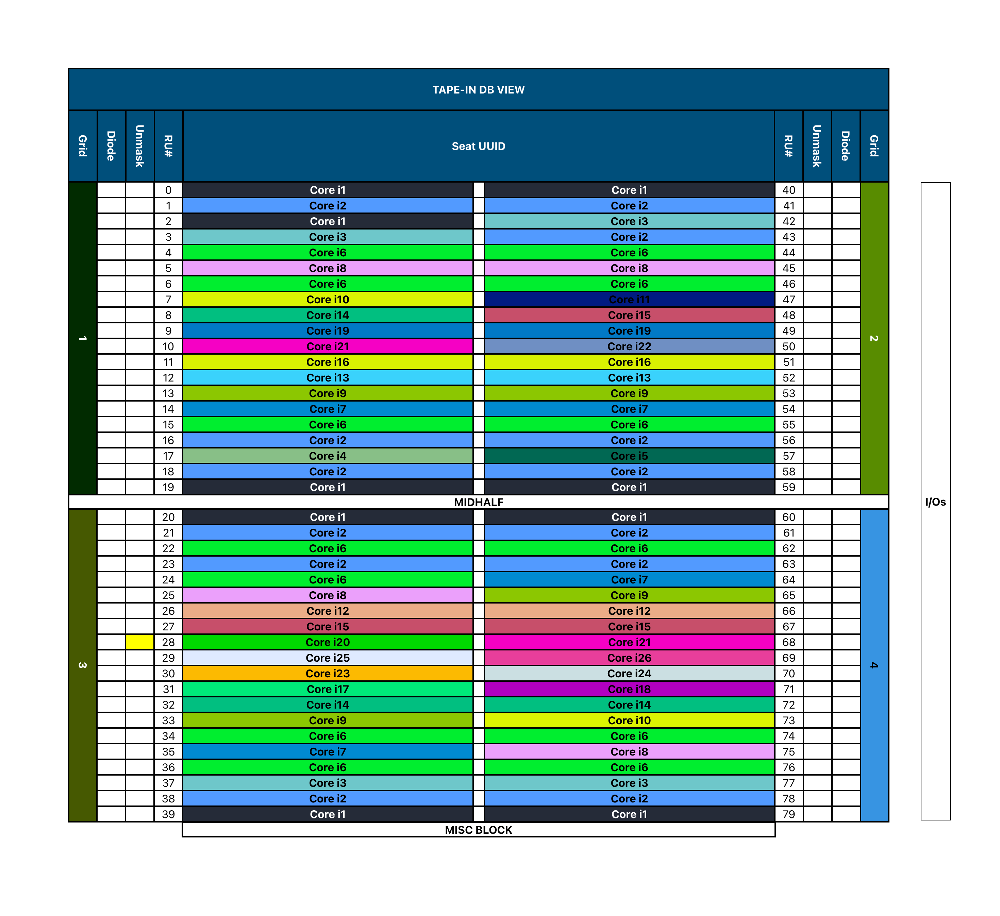

# Floor Plan (RU Table) Generation Application

This React-based application efficiently processes a JSON dataset, 
featuring product names and repetition counts, to generate a dynamic floor plan (RU Table). 

In the project directory, you can run:

### `npm start`

Runs the app in the development mode.\
Open [http://localhost:3000](http://localhost:3000) to view it in your browser.

Below is a screenshot of the application's main interface.

